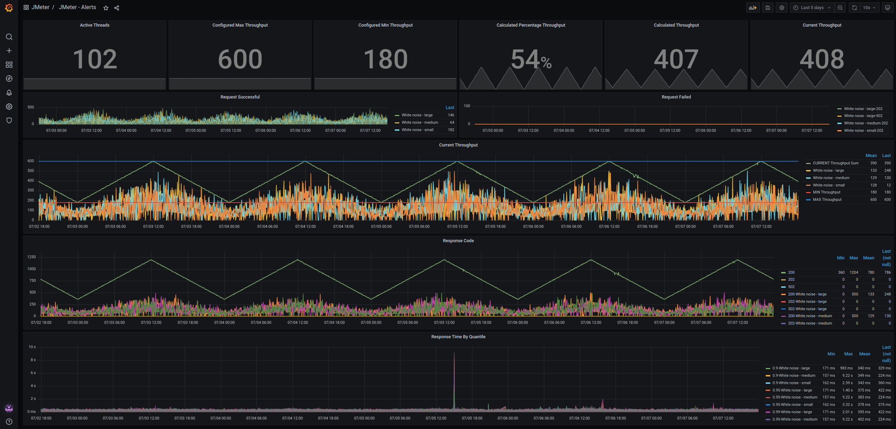

# JMeter Traffic Simulator

JMeter Traffic Simulator mimics a traffic pattern with high and low peak times and emits the results for Prometheus.
Other than normal JMeter test plans, its designed to run 24/7 and generates a permanent real life traffic pattern with 
peak and non-peak hours within a 24 hour time window.

## Versions
JMeter Traffic Simulator was tested using Jmeter version `5.5`.
Other versions may or may not work.


## Configuration

### JMeter Properties
Most of the settings are configurable by a [jmeter.properties](jmeter.properties) file.

| Section                                                                                                     | Setting                                                                                                           | Description                                                                                                                          | 
|-------------------------------------------------------------------------------------------------------------|:------------------------------------------------------------------------------------------------------------------|:-------------------------------------------------------------------------------------------------------------------------------------|
| [Endpoint Configuration](https://jmeter.apache.org/usermanual/component_reference.html#HTTP_Request_parms1) |                                                                                                                   |                                                                                                                                      |
|                                                                                                             | `protocol`                                                                                                          | Endpoint Protocol                                                                                                                    |
|                                                                                                             | `server`                                                                                                            | Endpoint host                                                                                                                        |
|                                                                                                             | `path`                                                                                                              | Endpoint path                                                                                                                        |
|                                                                                                             | `port`                                                                                                              | Endpoint port                                                                                                                        |
| Loadtest Configuration                                                                                      |                                                                                                                   |                                                                                                                                      |
|                                                                                                             | [`noThreads`](https://jmeter.apache.org/usermanual/component_reference.html#Thread_Group)                           | Specify the number of Threads (users)                                                                                                |
|                                                                                                             | [`rampUp`](https://jmeter.apache.org/usermanual/component_reference.html#Thread_Group)                              | Ramp up period till all Threads (users) are sending events                                                                           |
|                                                                                                             | [`lCount`](https://jmeter.apache.org/usermanual/component_reference.html#Thread_Group)                              | How often the Testplan should run. `-1` means forever                                                                                |
|                                                                                                             | [`targetThroughputPerMin`](https://jmeter.apache.org/usermanual/component_reference.html#Constant_Throughput_Timer) | If `dynamicTroughputEnabled` is disabled this specifies the number of events to send at a contant rate per minute                    |
| Dynamic Throughput configuration                                                                            |                                                                                                                   |                                                                                                                                      |
|                                                                                                             | `dynamicTroughputEnabled`                                                                                           | Enables the the simulation of a real life traffic pattern. If set to `true` this will overwrite the `targetThroughputPerMin` setting |
|                                                                                                             | `adjustmentIntervalMS`                                                                                              | How often in milliseconds should the current throughput traffic be recalculated                                                      |
|                                                                                                             | `peakHour`                                                                                                          | Peak hour at which the max traffic specified at `maxThroughputPerMin` should be reached. Format is from `0` to `24`                  |
|                                                                                                             | `nonPeakHour`                                                                                                       | Non-Peak hour at which the min traffic specified at `minThroughputPerMin` should be reached. Format is from `0` to `24`              |
|                                                                                                             | `maxThroughputPerMin`                                                                                               | Number of events per minute that should be send at `peakHour`                                                                        |
|                                                                                                             | `minThroughputPerMin`                                                                                               | Number of events per minute that should be send at `nonPeakHour`                                                                     |
| Prometheus configuration                                                                                    |                                                                                                                   |                                                                                                                                      |
|                                                                                                             | `prometheus.collect_jvm`                                                                                            | Boolean parameter for enabling JVM metrics collection                                                                                |
|                                                                                                             | `prometheus.quantiles_age`                                                                                          | Max age in seconds for Summary collectors' quantiles                                                                                 |
|                                                                                                             | `prometheus.log_errors`                                                                                             | Boolean parameter for enabling extended error logging                                                                                |

### JMeter Testplan
The Testplan can be modified via a local [JMeter installation](https://jmeter.apache.org/download_jmeter.cgi)
by starting jmeter with the testplan and the properties attached as parameters:

```
jmeter -t jmeter-testplan.jmx -p jmeter.properties
```

## Installing/Running

### JMeter client

The Testplan can be loaded into the client using the command specified under the section [JMeter Testplan](#jmeter-testplan).

The Jmeter client requires the Plugin [jmeter-prometheus-listener](https://github.com/kolesnikovm/jmeter-prometheus-listener).

### Docker-compose

A fully functional proof of concept can be started with [docker-compose](docker-compose.yml) by running:

`docker-compose --compatibility up --build`

Its spins up a simple [mockserver](https://hub.docker.com/r/mockserver/mockserver).
It expects `POST` requests on the endpoint `/check` and returns a status code `200` and a small json-body for every request.
This behaviour is configured as an [expectation](https://www.mock-server.com/mock_server/creating_expectations.html) in the [initializerJson.json](mockserver/initializerJson.json)
and is ingested in the container during startup.

The Jmeter Traffic Simulator container will be built during startup and is configured with the setting from the [jmeter.properties](jmeter.properties) file.

### Kubernetes

JMeter Traffic Simulator was designed to run 24/7 as a Pod within a Kubernetes cluster. The kustomize installation files can be found in the [kustomize](kustomize) directory.

Build and install on Kubernetes using [kustomize](https://kustomize.io/) and [kubectl](https://kubernetes.io/docs/tasks/tools/#kubectl):

```
kustomize build kustomize/overlays/dev/ | kubectl apply -f -
```

Please be sure to build and upload the JMeter image to a Container Registry your Kubernetes cluster have access to 
and replace the placeholder in the [deployment.yaml](kustomize/base/deployment.yaml):

`image: <image>:<tag>`

## Credits

Thanks to https://github.com/hauptmedia/docker-jmeter, https://github.com/hhcordero/docker-jmeter-server 
and https://github.com/justb4/docker-jmeter for the JMeter Dockerfile this project is based on.